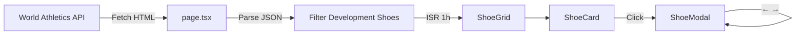

<div align="center">

# DevShoes

**World Athletics 개발 신발 트래커**

[](https://nextjs.org/)
[](https://www.typescriptlang.org/)
[](https://tailwindcss.com/)
[](https://vercel.com/)

World Athletics에서 승인 대기 중인 개발 신발(프로토타입)을 한눈에 확인하세요.

[Live Demo](https://new-shoes.vercel.app) · [Report Bug](https://github.com/kimsain/new_shoes/issues) · [Request Feature](https://github.com/kimsain/new_shoes/issues)

</div>

---

## Features

### Core Features
- **실시간 데이터 동기화** - World Athletics 공식 데이터를 매시간 자동 갱신 (ISR)
- **스마트 필터링** - 브랜드, 종목, 신발 유형, 승인 상태별 필터 + 검색
- **D-Day 시스템** - 승인 만료일까지 남은 기간을 색상으로 구분
- **반응형 디자인** - 데스크탑 사이드바 / 모바일 바텀시트 레이아웃

### UX Features
- **모달 네비게이션** - ← → 화살표 키로 이전/다음 신발 탐색
- **이미지 확대** - 모달에서 이미지 클릭 시 전체 화면으로 확대
- **키보드 단축키** - ESC로 닫기, 화살표로 이동
- **스마트 이미지 로딩** - 로딩 실패 시 자동 재시도, blur-to-sharp 트랜지션

### Animations
- **카드 호버** - 살짝 들어올림(lift) + 에메랄드 글로우 효과
- **바운스 진입** - 카드 그리드 stagger 애니메이션
- **모달 줌** - 부드러운 줌 인/아웃 트랜지션
- **햅틱 피드백** - 버튼 클릭 시 자연스러운 눌림 효과

### Accessibility
- 키보드 네비게이션 완전 지원
- ARIA 레이블 적용
- 최소 44px 터치 타겟
- `prefers-reduced-motion` 지원

## Tech Stack

| Category | Technology |
|----------|------------|
| Framework | Next.js 16 (App Router) |
| Language | TypeScript 5 |
| Styling | Tailwind CSS 4 |
| Runtime | React 19 |
| Deployment | Vercel |
| Data | World Athletics API (ISR 1h) |

## Performance

- **React.memo** - ShoeCard 불필요한 리렌더링 방지
- **Dynamic Import** - ShoeModal 코드 스플리팅 (Suspense)
- **Native Lazy Loading** - 이미지 지연 로딩
- **useCallback** - 이벤트 핸들러 메모이제이션

## Getting Started

### Prerequisites

- Node.js 18+
- npm or yarn

### Installation

```bash
# 저장소 클론
git clone https://github.com/kimsain/new_shoes.git
cd new_shoes

# 의존성 설치
npm install

# 개발 서버 실행
npm run dev
```

브라우저에서 [http://localhost:3000](http://localhost:3000)을 열어 확인하세요.

### Scripts

| Command | Description |
|---------|-------------|
| `npm run dev` | 개발 서버 실행 (http://localhost:3000) |
| `npm run build` | 프로덕션 빌드 |
| `npm start` | 프로덕션 서버 실행 |
| `npm run lint` | ESLint 검사 |

## Project Structure

```
src/
├── app/
│   ├── page.tsx           # 메인 페이지 (Server Component, 데이터 페칭)
│   ├── layout.tsx         # 루트 레이아웃
│   └── globals.css        # 글로벌 스타일 + 애니메이션
├── components/
│   ├── Header.tsx         # 헤더 (로고, 동기화 상태)
│   ├── ShoeGrid.tsx       # 신발 그리드 + 필터/검색 (레이아웃 관리)
│   ├── ShoeCard.tsx       # 신발 카드 (React.memo 최적화)
│   ├── ShoeModal.tsx      # 상세 모달 (이미지 줌, 키보드 네비게이션)
│   ├── SearchBar.tsx      # 검색 + 정렬 컴포넌트
│   ├── BottomSheet.tsx    # 모바일 필터 바텀시트
│   ├── EmptyState.tsx     # 검색 결과 없음 상태
│   ├── SectionHeader.tsx  # 섹션 헤더 (브랜드별)
│   └── filters/           # 필터 관련 컴포넌트
│       ├── SidebarFilter.tsx
│       ├── MobileFilter.tsx
│       ├── FilterChip.tsx
│       └── ActiveFilterBadge.tsx
├── hooks/
│   ├── useFilters.ts      # 필터 상태 관리 훅
│   └── useSearch.ts       # 디바운스 검색 훅
├── lib/
│   └── api.ts             # 데이터 페칭 유틸리티
├── styles/
│   └── tokens.ts          # 디자인 토큰 (색상, 스타일)
├── types/
│   ├── shoe.ts            # 신발 데이터 인터페이스
│   └── filters.ts         # 필터 타입 정의
├── utils/
│   ├── date.ts            # 날짜/D-day 유틸리티
│   └── displayNames.ts    # 종목명 축약
└── constants/
    └── index.ts           # 상수 (URL, 브랜드 우선순위)
```

## Data Flow



1. `page.tsx`에서 World Athletics FullList 페이지 HTML 페칭
2. `litProductsDataRaw` 변수에서 JSON 추출
3. `isDevelopmentShoe === true` 또는 `status === 'APPROVED_UNTIL'` 조건으로 필터링
4. 클라이언트 컴포넌트로 데이터 전달

## Status Colors

승인 만료까지 남은 기간에 따른 색상 구분:

| D-Day | Color | Meaning |
|-------|-------|---------|
| ≤ 0 | 🔴 Red | 만료됨 |
| ≤ 30 | 🟠 Amber | 긴급 |
| ≤ 90 | 🔵 Sky | 주의 |
| > 90 | 🟢 Emerald | 안전 |

## Responsive Layout

**Desktop (≥1024px)**
```
┌─────────┬──────────────────────┐
│ Sidebar │ Search + Sort        │
│ Filter  ├──────────────────────┤
│         │ Shoe Grid            │
└─────────┴──────────────────────┘
```

**Mobile (<1024px)**
```
┌────────────────────────┐
│ Search + Filter + Sort │ (sticky)
├────────────────────────┤
│ Shoe Grid              │
└────────────────────────┘
Filter → Bottom Sheet (85vh max)
```

## Keyboard Shortcuts

| Key | Action |
|-----|--------|
| `←` | 이전 신발 (모달) |
| `→` | 다음 신발 (모달) |
| `ESC` | 모달/확대 닫기 |
| `Enter` / `Space` | 카드 선택 |

## Design System

색상 및 스타일은 `src/styles/tokens.ts`에서 중앙 관리됩니다:

- `BG` - 배경 색상 (page, surface, interactive, overlay)
- `BORDER` - 테두리 색상 (subtle, default, hover, focus)
- `TEXT` - 텍스트 색상 (5단계)
- `STATUS` - D-day 상태 색상
- `FILTER` - 필터 카테고리 색상

## Data Source

모든 데이터는 [World Athletics Shoe Checker](https://certcheck.worldathletics.org/FullList)에서 제공됩니다.

> **Note**: 개발 신발(Development Shoes)은 지정된 기간 내에만 사용 가능하며, WAS Events 또는 Olympic Games에서는 사용할 수 없습니다.

## Contributing

1. Fork the repository
2. Create your feature branch (`git checkout -b feature/amazing-feature`)
3. Commit your changes (`git commit -m 'Add amazing feature'`)
4. Push to the branch (`git push origin feature/amazing-feature`)
5. Open a Pull Request

## License

This project is for educational purposes. All shoe data belongs to World Athletics.

---

<div align="center">

Made with ❤️ by [kimsain](https://github.com/kimsain)

</div>
